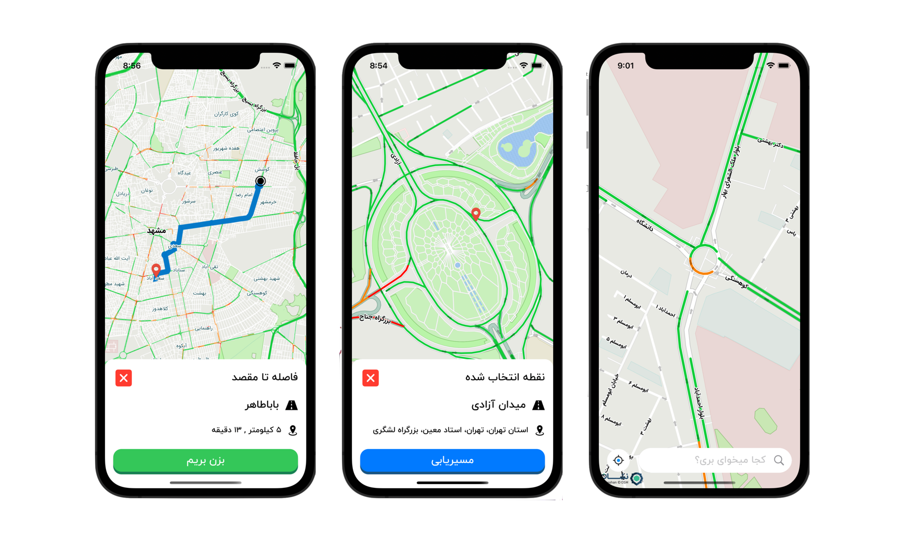

# NeshanNav
# MVVM Clean iOS project

This is a clean iOS project structured as follow:

- MVVM
- Clean architecture
- Repository pattern
- Cocoapods for dependency manager

Application main activity contain a map. The application starts to find your location. Then it shows your accurate location on the map. Users must be able to choose a location as a destination on the map. The application then gets a route from the user’s current location to the destination and displays the route shape on the map. After getting the route, the user can start navigation.

Installation

Dependencies in this project are provided via Cocoapods. Please install all dependecies with

pod install

